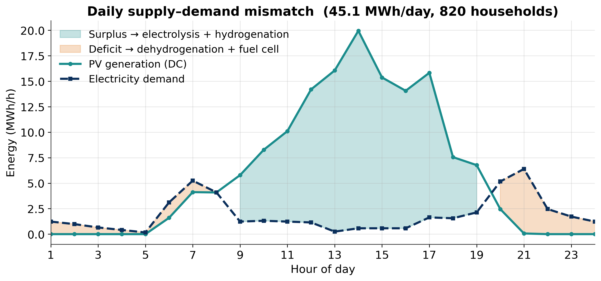
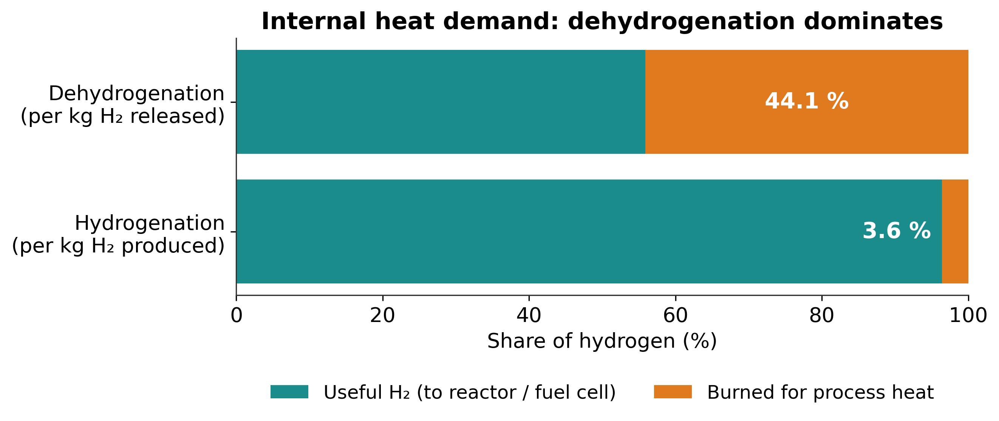
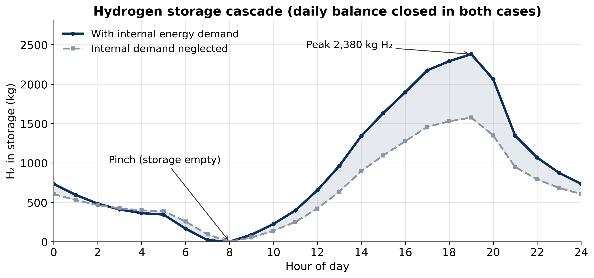
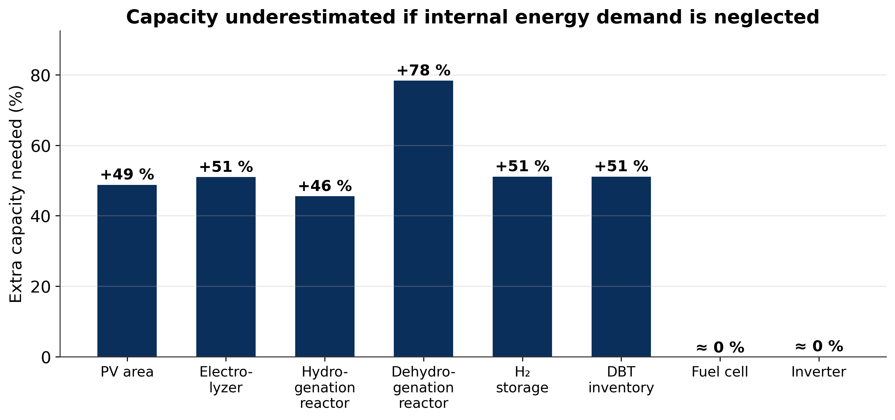
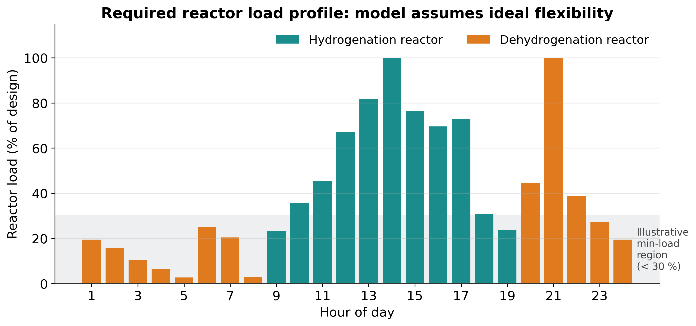
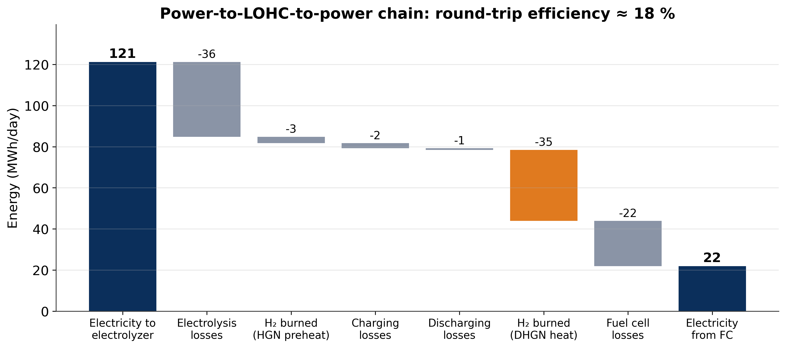
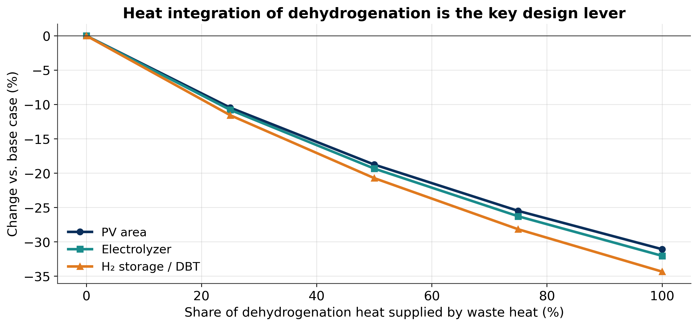

# LOHC-Storage-RESS

[](https://github.com/Parthiv18122000/LOHC-Storage-RESS/actions/workflows/ci.yml)
[](https://www.python.org/)
[](LICENSE)

A Python toolkit for **cascade (pinch) analysis** of self-sufficient PV–LOHC energy systems.

Given hourly PV irradiance and community electricity demand, the model iteratively sizes a complete hydrogen supply chain — electrolyzer, hydrogenation/dehydrogenation reactors, hydrogen storage, fuel cell, and DBT inventory — and quantifies how much each component is underestimated when internal process energy demand is neglected.

**LOHC carrier:** dibenzyltoluene (H0-DBT / H18-DBT)  
**Method:** Mah et al., *Energy* **218** (2021) 119475

---

## Results

### Equipment Sizing (820 households, German summer day, 45.1 MWh/day)

| Equipment | With internal demand | Demand neglected | Undersizing if neglected |
|---|---|---|---|
| PV area | 218,055 m² | 146,563 m² | **+49 %** |
| Electrolyzer | 19,347 kW | 12,811 kW | **+51 %** |
| Hydrogenation reactor | 445 kg H₂/h | 305 kg H₂/h | **+46 %** |
| Dehydrogenation reactor | 814 kg H₂/h | 457 kg H₂/h | **+78 %** |
| H₂ storage | 2,705 kg | 1,793 kg | **+51 %** |
| DBT inventory | 45,466 kg | 30,129 kg | **+51 %** |
| Fuel cell | 13,199 kW H₂ input | 13,239 kW H₂ input | ≈ 0 % |
| Inverter | 6,665 kW | 6,665 kW | ≈ 0 % |

> Neglecting internal heat and pump demand leads to 49–78 % undersizing across the key components.

### Self-Consumption Fractions

| Process | H₂ burned for heat | Converges in |
|---|---|---|
| Hydrogenation | 3.6 % | 5 iterations |
| Dehydrogenation | 44.1 % | direct (explicit) |

The dehydrogenation step consumes **44 % of released H₂** for endothermic reactor heating and DBT preheating — the dominant internal energy demand.

### System KPIs

| KPI | Value |
|---|---|
| Round-trip efficiency (FC out / EL in) | 18.1 % |
| Hydrogenation operating hours/day | 11 h |
| HGN min load (% of design) | 23.3 % |
| Dehydrogenation operating hours/day | 13 h |
| DHGN min load (% of design) | 2.6 % |

---

## Plots

### Daily Supply–Demand Mismatch


### Internal Heat Demand: Self-Consumption Split


### Hydrogen Storage Cascade


### Undersizing If Internal Demand Neglected


### Required Reactor Load Profile


### Power-to-LOHC-to-Power Energy Chain


### Heat-Integration Sensitivity


---

## Methodology

### Cascade Analysis Framework

The model follows the cascade (pinch) analysis of Mah et al. (2021), extended with iterative self-consumption fractions:

**1. Self-consumption fractions (iterative)**

Two fractions govern how much hydrogen and electricity are consumed internally rather than delivered to the community:

- *Hydrogenation*: fraction of excess DC to the HGN pump (`f_pump`) and fraction of produced H₂ burned for DBT preheating (`f_fuel`) — solved iteratively until convergence.
- *Dehydrogenation*: fraction of FC electricity to the DHGN pump and fraction of released H₂ burned for preheating + endothermic reaction heat — solved directly.

**2. Hourly cascade**

For each hour, PV surplus drives electrolysis → hydrogenation → H₂ storage charging; PV deficit drives H₂ storage withdrawal → dehydrogenation → fuel cell. The storage trajectory is pinch-shifted so that the minimum storage equals zero (physically closed).

**3. PV area iteration**

The PV area is updated by a Newton-style correction until the daily storage balance closes (H₂ stored at hour 0 = H₂ stored at hour 24) to within 0.05 %.

### Key Equations

$$\dot{H}_{CH}(t) = \dot{E}_{EL}(t) \cdot Y_{EL} \cdot (1 - f_{fuel,HGN}) \cdot \eta_{CH}$$

$$\dot{H}_{DI}(t) = \frac{|\dot{E}_{FC}(t)|}{(1 - f_{pump,DHGN}) \cdot \eta_{FC} \cdot LHV} \cdot \frac{1}{(1 - f_{fuel,DHGN}) \cdot \eta_{DI}}$$

$$H_{ST}(t) = H_{ST}(t-1) + \dot{H}_{CH}(t) + \dot{H}_{DI}(t)$$

$$A_{PV,new} = A_{PV} - \frac{H_{ST}(24) - H_{ST}(0)}{\sum_t SR_t \cdot \eta_{PV} \cdot Y_{EL} \cdot (1 - f_{fuel,HGN}) \cdot (1 - f_{pump,HGN}) \cdot \eta_{CH}}$$

---

## Installation

```bash
git clone https://github.com/Parthiv18122000/LOHC-Storage-RESS.git
cd LOHC-Storage-RESS
pip install -e ".[dev]"
```

---

## Quick Start

```python
from lohc_cascade import (
    Params,
    hydrogenation_fractions,
    dehydrogenation_fractions,
    size_system,
)

p = Params()

# Solve self-consumption fractions
fp_h, ff_h, iters = hydrogenation_fractions(p)
fp_d, ff_d, _     = dehydrogenation_fractions(p)
f_self = (fp_h, ff_h, fp_d, ff_d)

# Size the system
results, df, storage = size_system(p, f_self)

print(f"PV area        : {results['PV area (m2)']:,.0f} m²")
print(f"H₂ storage     : {results['H2 storage (kg)']:,.0f} kg")
print(f"Electrolyzer   : {results['Electrolyzer (kW)']:,.0f} kW")
```

### Sensitivity: heat integration

```python
from dataclasses import replace

for share in [0.0, 0.25, 0.50, 0.75, 1.0]:
    ps = replace(p, ext_heat_share=share)
    fp_h, ff_h, _ = hydrogenation_fractions(ps)
    fp_d, ff_d, _ = dehydrogenation_fractions(ps)
    res, _, _ = size_system(ps, (fp_h, ff_h, fp_d, ff_d))
    print(f"  {share*100:.0f}% waste heat → PV {res['PV area (m2)']:,.0f} m²")
```

See [`examples/`](examples/) for complete scripts.

---

## API Reference

### `Params`

Immutable dataclass with all system parameters. Key fields:

| Field | Default | Description |
|---|---|---|
| `L_cap` | 0.062 | kg H₂ / kg loaded DBT |
| `eta_HGN` | 0.90 | Degree of loading (hydrogenation) |
| `eta_DHGN` | 0.88 | Degree of unloading (dehydrogenation) |
| `T_HGN` | 150 °C | Hydrogenation temperature |
| `T_DHGN` | 330 °C | Dehydrogenation temperature |
| `dH_r` | 65.4 kJ/mol H₂ | Endothermic reaction enthalpy |
| `PV_eff` | 0.15 | PV module efficiency |
| `Y_EL` | 0.021 kg H₂/kWh | Electrolyzer specific yield |
| `FC_eff` | 0.50 | Fuel cell electrical efficiency |
| `ext_heat_share` | 0.0 | Fraction of DHGN heat from external waste heat |

### `hydrogenation_fractions(p, E_ex=100.0) → (f_pump, f_fuel, iterations)`

Iteratively solve for hydrogenation self-consumption fractions.

### `dehydrogenation_fractions(p, L_L=12.0) → (f_pump, f_fuel, heat_breakdown)`

Directly compute dehydrogenation self-consumption fractions.

### `cascade(A_pv, p, f) → (df, raw, shifted)`

Compute hourly H₂ storage cascade for a given PV area and self-consumption fractions `f = (fp_h, ff_h, fp_d, ff_d)`.

### `size_system(p, f, A0=200_000.0, verbose=False) → (results, df, storage)`

Iterate PV area until daily storage balance closes. Returns equipment sizing dict, cascade DataFrame, and shifted storage profile.

---

## Running Tests

```bash
pytest tests/ -v --cov=lohc_cascade
```

---

## Reference

A.X.Y. Mah, W.P.Q. Ng, C.T. Lee, P.Y. Ong, Z.A. Zakaria, Z.Y. Ng,
"Cascade analysis for self-sufficient solar-powered liquid organic hydrogen
carrier (LOHC) system",
*Energy* **218** (2021) 119475.
[https://doi.org/10.1016/j.energy.2020.119475](https://doi.org/10.1016/j.energy.2020.119475)

---

## License

MIT — see [LICENSE](LICENSE).