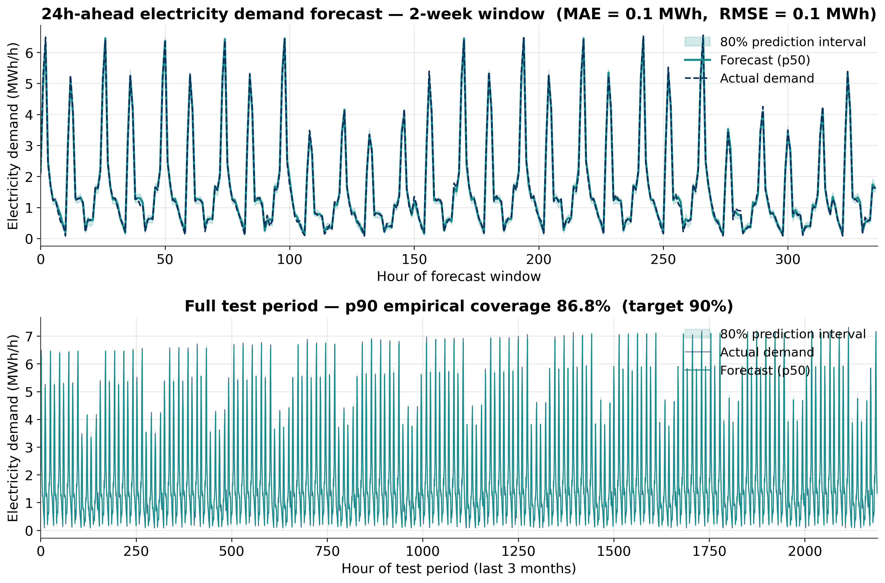

# LOHC-Storage-RESS

[](https://github.com/parthivmehta1812/LOHC-Storage-RESS/actions/workflows/ci.yml)
[](https://www.python.org/)
[](LICENSE)

A Python toolkit for **cascade (pinch) analysis** of self-sufficient PV–LOHC energy systems, extended with **24h-ahead electricity demand forecasting**.

Given hourly PV irradiance and community electricity demand, the model iteratively sizes a complete hydrogen supply chain and quantifies how much each component is underestimated when internal process energy demand is neglected. A GBM demand forecaster shows how uncertainty in the load profile propagates into the sizing workflow.

**LOHC carrier:** dibenzyltoluene (H0-DBT / H18-DBT)  
**Method:** Mah et al., *Energy* **218** (2021) 119475

---

## Results

### Equipment Sizing (820 households, German summer day, 45.1 MWh/day)

| Equipment | With internal demand | Demand neglected | Undersizing if neglected |
|---|---|---|---|
| PV area | 218,055 m² | 146,563 m² | **+49 %** |
| Electrolyzer | 19,347 kW | 12,811 kW | **+51 %** |
| Hydrogenation reactor | 445 kg H₂/h | 305 kg H₂/h | **+46 %** |
| Dehydrogenation reactor | 814 kg H₂/h | 457 kg H₂/h | **+78 %** |
| H₂ storage | 2,705 kg | 1,793 kg | **+51 %** |
| DBT inventory | 45,466 kg | 30,129 kg | **+51 %** |
| Fuel cell / Inverter | — | — | ≈ 0 % |

> Neglecting internal heat and pump demand leads to **49–78 % undersizing** across key components. The dominant cause: dehydrogenation burns **44 % of released H₂** for reactor heating.

### Demand Forecasting — 24h-ahead, last 3 months hold-out

| Metric | Value |
|---|---|
| MAE | 68 kWh/h |
| RMSE | 87 kWh/h |
| p90 empirical coverage | 86.8 % (target 90 %) |
| Training data | 9 months (6,402 samples) |

---

## Plots

### Hydrogen storage cascade — with vs. without internal demand


### Capacity underestimated if internal demand neglected


### 24h-ahead electricity demand forecast with 80% prediction intervals


---

## Methodology

### Cascade Analysis Framework

The model follows Mah et al. (2021), extended with iterative self-consumption fractions:

**1. Self-consumption fractions**
- *Hydrogenation*: fraction of excess DC to the HGN pump and fraction of H₂ burned for DBT preheating — solved iteratively (converges in 5 iterations).
- *Dehydrogenation*: fraction of FC electricity to DHGN pump and fraction of H₂ burned for preheating + endothermic reaction heat — solved directly.

**2. Hourly cascade**
PV surplus → electrolysis → hydrogenation → H₂ storage charging; PV deficit → H₂ withdrawal → dehydrogenation → fuel cell. Storage trajectory is pinch-shifted so the minimum equals zero.

**3. PV area iteration**
Newton-style update until daily storage balance closes (H₂ at hour 0 = H₂ at hour 24, <0.05% tolerance).

**4. Demand forecasting**
GBM trained on a synthetic annual demand dataset (base profile + weekday/weekend + seasonal variation + noise). Features: cyclic calendar encoding (sin/cos), lagged demand (t−24, t−48, t−168), rolling statistics. Three models: p10, p50, p90.

---

## Installation

```bash
git clone https://github.com/parthivmehta1812/LOHC-Storage-RESS.git
cd LOHC-Storage-RESS
pip install -e ".[dev]"
```

---

## Quick Start

### Cascade sizing

```python
from lohc_cascade import (
    Params, hydrogenation_fractions, dehydrogenation_fractions, size_system,
)

p = Params()
fp_h, ff_h, _ = hydrogenation_fractions(p)
fp_d, ff_d, _ = dehydrogenation_fractions(p)

results, df, storage = size_system(p, (fp_h, ff_h, fp_d, ff_d))
print(f"PV area    : {results['PV area (m2)']:,.0f} m²")
print(f"H₂ storage : {results['H2 storage (kg)']:,.0f} kg")
```

### Demand forecasting

```python
from lohc_cascade import make_annual_demand, train_demand_forecaster, forecast_demand
import numpy as np

demand = make_annual_demand(n_days=365)

models = train_demand_forecaster(demand, train_end_h=6570)
point, lower, upper = forecast_demand(models, demand, start_h=6570, end_h=8760)

actuals = demand[6570:8760]
print(f"MAE       : {np.mean(np.abs(point - actuals)) / 1000:.1f} MWh")
print(f"p90 cover : {np.mean(actuals <= upper) * 100:.1f}%")
```

### Heat integration sensitivity

```python
from dataclasses import replace

for share in [0.0, 0.25, 0.50, 0.75, 1.0]:
    ps = replace(p, ext_heat_share=share)
    fp_h, ff_h, _ = hydrogenation_fractions(ps)
    fp_d, ff_d, _ = dehydrogenation_fractions(ps)
    res, _, _ = size_system(ps, (fp_h, ff_h, fp_d, ff_d))
    print(f"  {share*100:.0f}% waste heat → PV {res['PV area (m2)']:,.0f} m²")
```

See [`examples/`](examples/) for complete scripts.

---

## API Reference

### `Params`

Frozen dataclass with all system parameters. Key fields:

| Field | Default | Description |
|---|---|---|
| `T_DHGN` | 330 °C | Dehydrogenation temperature |
| `dH_r` | 65.4 kJ/mol H₂ | Endothermic reaction enthalpy |
| `PV_eff` | 0.15 | PV module efficiency |
| `Y_EL` | 0.021 kg H₂/kWh | Electrolyzer specific yield |
| `FC_eff` | 0.50 | Fuel cell electrical efficiency |
| `ext_heat_share` | 0.0 | Fraction of DHGN heat from external waste heat |

### `size_system(p, f, A0, verbose) → (results, df, storage)`

Iterates PV area until daily storage balance closes. Returns equipment sizing dict, cascade DataFrame, and shifted storage profile.

### `make_annual_demand(n_days, weekday_scale, weekend_scale, ...) → np.ndarray`

Generates a synthetic annual demand profile with weekday/weekend, seasonal variation, and Gaussian noise. Shape: `(n_days × 24,)`.

### `train_demand_forecaster(demand, train_end_h, n_estimators) → tuple`

Returns `(model_p50, model_p10, model_p90)` — three fitted scikit-learn GBM estimators.

### `forecast_demand(models, demand, start_h, end_h) → tuple`

Returns `(point, lower, upper)` — p50, p10, p90 demand forecasts as `np.ndarray` [kWh/h].

---

## Running Tests

```bash
pytest tests/ -v --cov=lohc_cascade
```

---

## Reference

A.X.Y. Mah et al., *Energy* **218** (2021) 119475.  
[https://doi.org/10.1016/j.energy.2020.119475](https://doi.org/10.1016/j.energy.2020.119475)

---

## License

MIT — see [LICENSE](LICENSE).